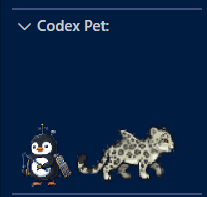

# Codex Custom Pets Pack

A collection of custom pixel-art companions designed for the Codex Pet extension in VS Code.



---

## Included Pets

| Pet | Description | Status |
| :--- | :--- | :---: |
| **Cyborg Penguin** | A tech-rigged fishing penguin equipped with antennas and gear. | Ready |
| **Snow Leopardshark** | A mountain snow leopard hybrid featuring an aerodynamic shark dorsal fin. | Ready |
| **Turquoise & White Koi** | An elegant, vibrant koi gliding across your editor. | Work in Progress |
| **Stegosapo** | A prehistoric hybrid combining a frog and a stegosaurus. | Work in Progress |

---

## Design & AI Workflow Disclosure

- **Visual Concept & Design:** The artistic concepts and original character ideas are entirely mine. Generative AI tools were used to adapt these designs into a cohesive pixel-art sprite format.
- **Code & Functionality:** The folder architecture, frame alignments, and configuration files needed to make these sprites fully operational within Codex were developed with heavy assistance from AI.

---

## Installation

### Prerequisites
Make sure you have the [Codex Pet](https://marketplace.visualstudio.com/items?itemName=DinohouseDigitalLLC.vscode-codex-pet) extension installed in VS Code:
* Extension ID: `dinohousedigitalllc.vscode-codex-pet`

---

### Step-by-Step Setup

1. **Clone or download** this repository:
   ```bash
   git clone https://github.com/Pau-Gallego-Cistero/codex-custom-pets.git
